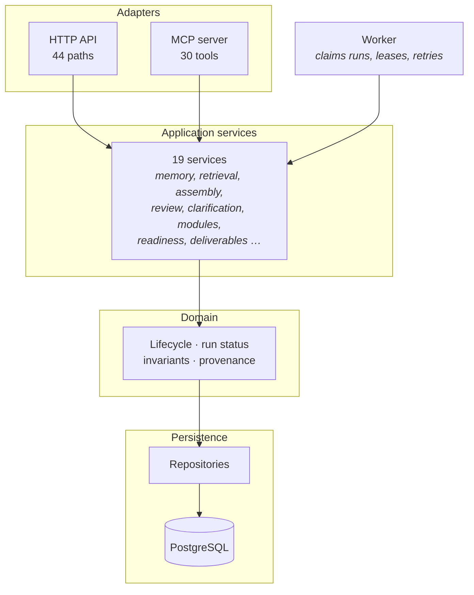

# Components

The layers inside KAE-Memory, and which one enforces what.

---

## Adapters

Translate a protocol into an application call and back. **They hold no rules.**
Two adapters over one set of services is what makes parity checkable — and what
`tests/api/test_adapter_parity.py` enforces, in both directions.

## Application services

Nineteen, each owning one area: memory, retrieval, assembly, review,
clarification, classification, ingestion, modules, readiness, deliverables,
publication, blueprint, render, setup, preliminary context, assumptions,
re-embedding.

They orchestrate. They do not re-implement domain rules.

## Domain

Where the rules live, and the reason the rest of the architecture holds:

| Rule | Module |
|---|---|
| Lifecycle transitions | `domain/lifecycle.py` |
| Run-status transitions | `domain/execution.py` |
| Knowledge kinds | `domain/models.py` |
| Errors that classify | `domain/errors.py` |

**Not in the schema.** A direct database write therefore produces state no rule
checked, which is why that sits outside supported workflows
([ADR-0027](../../specifications/ADR/ADR-0027-application-contracts-are-the-write-path.md)).

## Worker

A separate process. Claims queued runs with a lease, executes extraction, and
records the outcome — including which model, or that the offline fixture ran.

Separate because extraction is slow and failure-prone. A request that waited on
it would tie a client's timeout to a model provider's, and a crash mid-run would
lose a message rather than a retryable run.

The lease is what makes a crashed worker's run reclaimable instead of stuck.

## Capability registry

`capabilities.py` — 43 declarations of where each capability should be reachable.

Unusual enough to call out: it is **enforced**, not descriptive. A declared
capability missing from an adapter fails the suite, and so does a tool or route
the registry does not declare. It exists because a twelve-capability divergence
once accumulated across five phases while every planning document claimed the
surfaces were peers, and nothing checked.

## Related

- [System context](system-context.md) · [Persistence and providers](persistence-and-providers.md)
- [Capability matrix](../reference/capability-matrix.md)
