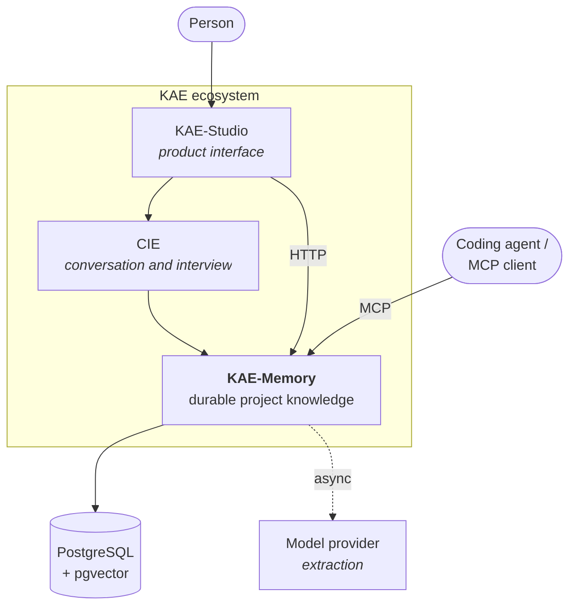

# System context

Where KAE-Memory sits, and what it is not responsible for.

---

## Who owns what

| Component | Owns | Does not |
|---|---|---|
| **KAE-Studio** | Everything a person looks at | Hold durable project state |
| **CIE** | Deciding what to ask and how | Persist knowledge |
| **KAE-Memory** | Durable knowledge, retrieval, context assembly | Render anything, or decide what a project should do |

KAE-Memory is headless by decision
([ADR-0026](../../specifications/ADR/ADR-0026-kae-memory-is-headless.md)). It
ships no interface and builds none.

## Two kinds of client

**Agents** connect over MCP. They submit observations, read briefings, and ask
for module-scoped context. Some capabilities exist only here, because an
implementing agent is the consumer.

**Applications** connect over HTTP. Studio is the one that exists. Some
capabilities exist only here for the same reason in reverse.

The adapters are peers over the same application services
([ADR-0023](../../specifications/ADR/ADR-0023-http-and-mcp-as-peer-adapters.md)),
and the [capability matrix](../reference/capability-matrix.md) is the record of
where each difference is deliberate.

## The model is not the architecture

Extraction calls a model provider **asynchronously**, from the worker. Nothing a
client calls waits on it.

And nothing a model returns becomes project truth on its own — it becomes a
candidate. That boundary is why KAE-Memory can use a model without inheriting a
model's confidence.

Without provider access, extraction falls back to a deterministic fixture and
records that it did.

## What is not here

**Cloud provisioning.** This repository creates no cloud resources and ships no
provisioning automation. Deployment coordination for the wider ecosystem lives
outside the public component.

**A user interface.** Studio's, separately.

**Interview intelligence.** CIE's. KAE-Memory produces clarifications from
structural gaps; turning those into a conversation is not its job, and its
clarification text is machine-facing because of that.

## Related

- [Components](components.md) · [Persistence and providers](persistence-and-providers.md)
- [Security boundaries](security-boundaries.md)
