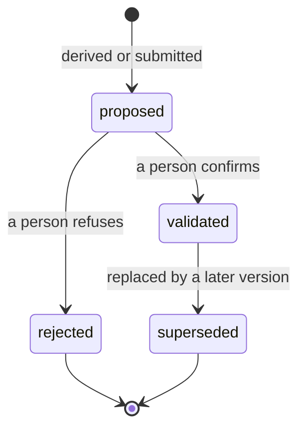

# Knowledge lifecycle

How something goes from being said to being something the project holds — and
why most of it stops short of that.

The short version: **nothing an agent produces becomes project truth on its own.**
Evidence is stored as given, candidates are derived from it, and a person decides
which candidates the project stands behind. Every stage below exists to keep
those three apart.

> **Scope.** This page documents the current `KnowledgeItem.lifecycle` and legacy
> Confirm/Reject behavior. It is one transitional axis, not the whole epistemic model.
> Synthesized-object lifecycle, evidence role, formation, authority, currency, and human
> attention are separate; see [Epistemic knowledge model](epistemic-knowledge-model.md).

---

## The states

Four states, two terminal. Enforced in `domain/lifecycle.py`; an attempted
transition outside this table raises `InvalidLifecycleTransitionError` rather
than being written.

| From | May become |
|---|---|
| `proposed` | `validated`, `rejected` |
| `validated` | `superseded` |
| `rejected` | *(nothing)* |
| `superseded` | *(nothing)* |

Three consequences worth stating plainly:

**Rejection is final and is kept.** A rejected item never returns to `proposed`.
It is retained rather than deleted, because what a project decided against is
part of what it knows — and because a candidate that could quietly reappear
would make review meaningless.

**Confirmation is not editing.** A confirmed item does not go back to `proposed`
to be changed. A correction creates a new version and the old one becomes
`superseded`, so the record shows what was believed and when.

**There is no route from `rejected` to `validated`.** If a rejected idea turns
out to be right, it is recorded again as a new item with its own provenance. The
history keeps the fact that it was once refused.

---

## The path

### 1. Evidence arrives

Through a conversation message, `kae_submit_observation`, or
`kae_ingest_document`.

Stored **verbatim**. Whatever is derived later sits beside the evidence, never
over it — so a derivation can be wrong without corrupting what was actually
said.

A message from a person queues extraction. A message from an agent does not. An
agent's own output re-entering as evidence for its next inference is a loop that
manufactures confidence from nothing.

### 2. Extraction proposes

A run is queued. **This is asynchronous** — the message is durable immediately;
candidates appear when the run completes.

> If you submit something and see no knowledge yet, that is usually the run not
> having finished, not a failure. Check the run rather than resubmitting.

Extraction produces items with a **kind** — `actor`, `goal`, `rule`,
`constraint`, `requirement`, `decision`, `assumption`, `unknown` — all in
`proposed`.

`unknown` is not a failure. It is extraction reporting what the evidence did not
settle, instead of inventing something plausible. Those become questions a
person can answer.

> **Without model access, extraction falls back to a deterministic fixture.**
> Runs then report `"model": "deterministic-fixture"`. The pipeline works; it is
> not reasoning. See [F-008](../../specifications/FINDINGS_REGISTER.md).

### 3. A person decides

Candidates wait. Confirming moves an item to `validated`; rejecting moves it to
`rejected`.

Rejection requires the **version the reviewer read** (`expected_version`).
Rejecting a version that has since changed is refused with a `409` naming both.
The point is narrow and worth it: you cannot refuse wording nobody showed you.

> **Limitation.** The `reviewer` recorded is caller-supplied and unattested. An
> agent can name a person who never decided. See
> [VG-3](../../specifications/VERIFICATION_GATES.md) and
> [F-004](../../specifications/FINDINGS_REGISTER.md).

### 4. Corrections make versions

Content is replaced by adding a version; the previous becomes `superseded`.
History is append-only. Nothing is edited in place and nothing is removed.

### 5. What confirmation feeds

Context assembly draws on confirmed knowledge only — an unconfirmed candidate
never reaches a generated document. **Readiness is different**, and the
difference is deliberate: `evaluate_area` marks an area `partial` when it holds
candidates and no confirmations, and `partial` earns half credit. So extraction
moves the percentage before anybody reviews anything.

What confirmation buys is *completing* an area, not entering the calculation. An
area reaches `sufficient` only on confirmed items meeting its minimum, and only
`sufficient` earns full credit.

---

## Where the rules live

**In application code, not in the database.** `domain/lifecycle.py` holds the
transition table; the schema holds none of it.

That is deliberate, and it is why clients act through the supported interfaces
rather than the database (ADR-0027). An `UPDATE ... SET lifecycle='validated'`
succeeds at the SQL level and produces a statement the project believes a person
confirmed — with no reviewer, no version check, no transition validation, no
trace. Nothing downstream can tell it apart from a real confirmation.

> That direct writes bypass these rules is **reasoned from where the code lives,
> not demonstrated by a test** — [F-011](../../specifications/FINDINGS_REGISTER.md).

---

## What this is not

**Not a workflow engine.** There are no approvals, assignees or routing. Four
states and the transitions above.

**Not automatic.** Nothing promotes itself with time, agreement, or repetition.
Ten agents proposing the same statement produce ten candidates, not a
confirmation.

**Not a chat log.** Messages are evidence and are kept; knowledge is derived from
them and is separate. Deleting neither affects the other.

---

## Next

- [Epistemic knowledge model](epistemic-knowledge-model.md) — how formation, authority,
  evidence role, currency, synthesis, and attention stay separate
- [Provenance and evidence](provenance-and-evidence.md) — tracing an item back
- [Reviewing knowledge](../workflows/review-knowledge.md) — doing the deciding
- [Clarifications and unknowns](clarifications-and-unknowns.md) — what gaps become
- [Glossary](../glossary.md) — the vocabulary
