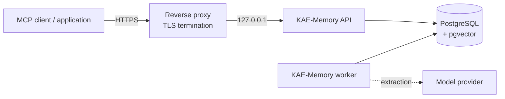

# Deployment

Running KAE-Memory on a Linux host. Provider-neutral: the assets in this
repository assume no hosting provider and create no cloud resources.

> **Under active development.** No production-readiness claim. Read
> [security boundaries](../architecture/security-boundaries.md) before exposing
> the service — it states what the startup guards do and do not cover.

---

## Shape



Two processes against one database. The API answers requests; the worker claims
queued runs and does extraction. They are separate units and can be restarted
independently.

**The API binds to loopback and a proxy terminates TLS.** That is the supported
shape ([ADR-0024](../../specifications/ADR/ADR-0024-http-trust-boundary.md)) and
it carries an obligation described below.

## Prerequisites

- Linux host, systemd
- Python as required by `pyproject.toml`
- PostgreSQL 16+ with `pgvector`, reachable privately from the host
- A reverse proxy for TLS
- Model provider access, if extraction should use a model rather than the
  offline fixture

## Install

```bash
sudo ./deploy/server/install.sh
```

Idempotent. Creates the application, environment, log and state directories,
installs the systemd units, and writes **empty, root-owned** environment files
for an operator to fill in. It installs no Docker, assumes no provider, creates
no cloud resources, and embeds no credentials.

Then fill `/etc/kae-memory/api.env` and `/etc/kae-memory/worker.env` — see
[configuration](../reference/configuration.md).

## Migrate

```bash
alembic upgrade head
```

Before starting the services. `/health` reports the applied revision, so this is
verifiable afterwards without opening the database.

## Start

```bash
sudo systemctl restart kae-api kae-worker
```

**`restart`, not `enable --now`.** `enable --now` starts a *stopped* unit and
does nothing to a running one — a deployment that updates configuration and uses
it will report success while the old process keeps running with the old
settings. That failure has happened here, and it is silent.

## Verify

Three checks, in order. The third is the one people skip.

**Locally:**

```bash
curl -s localhost:8000/health
# {"status":"ok","database":"up","migration_revision":"0021","version":"0.1.0"}
```

`"database":"down"` means the connection string is wrong or the database is
unreachable. A null revision means migrations have not run.

**Through the proxy, authenticated:**

```bash
curl -s -H "Authorization: Bearer $TOKEN" https://your-host/v1/projects
```

**Through the proxy, unauthenticated — this must fail:**

```bash
curl -s -o /dev/null -w '%{http_code}\n' https://your-host/v1/projects
# expect 401
```

**A `200` means the deployment is unauthenticated.** Nothing else will tell you:
the process starts, health is green, and authenticated requests work either way.
Run this after every restart, not only at first deployment.

## Reverse proxy

`deploy/server/reverse-proxy/kae.conf.example` is a starting point. Terminate
TLS, proxy to `127.0.0.1:8000`, and do not expose port 8000 directly.

## Cloud environments

The hosted environment for this project is **Amazon RDS for PostgreSQL**. That
is a PostgreSQL deployment profile, not a separate provider — the application
needs a PostgreSQL connection string and `pgvector`, and does not care what
manages the instance.

**This repository ships no cloud provisioning automation.** Documenting
infrastructure it does not create would describe something you cannot reproduce
from it. The instructions above work against RDS, another managed PostgreSQL, or
a container.

For RDS specifically, only two things differ from any other managed instance:
`pgvector` is enabled per-database rather than per-instance, and the supported
shape gives the instance no public address, so the application reaches it
privately.

## Upgrades

1. Stop the worker; let in-flight runs finish or be reclaimed by lease expiry
2. Deploy the new code
3. `alembic upgrade head`
4. `restart` both units
5. Verify — including the unauthenticated check

## Related

- [Configuration](../reference/configuration.md)
- [Security boundaries](../architecture/security-boundaries.md)
- [Persistence and providers](../architecture/persistence-and-providers.md)
- `operations/runbooks/` — operator procedures
